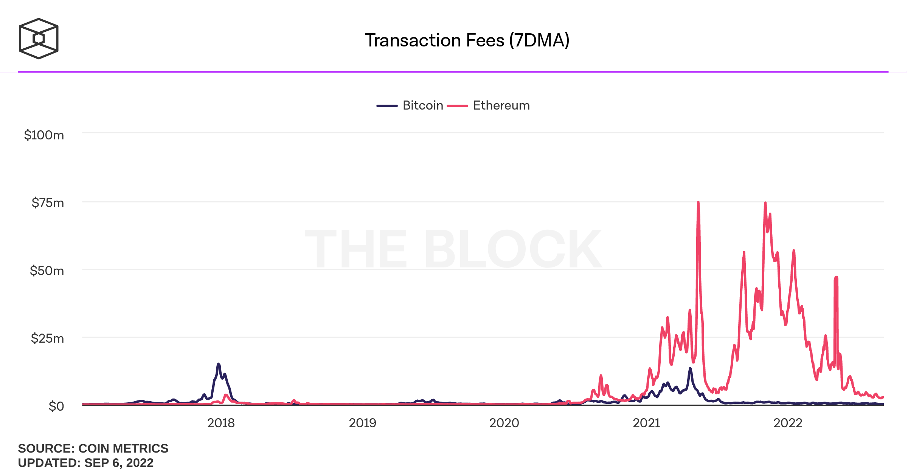
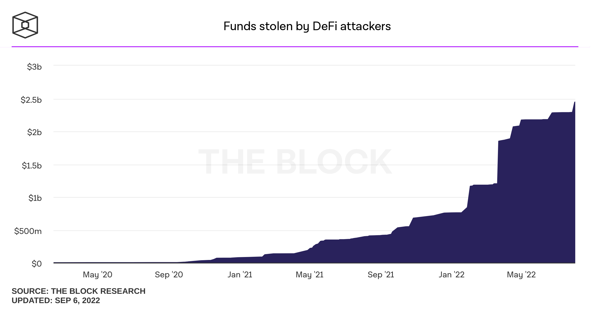
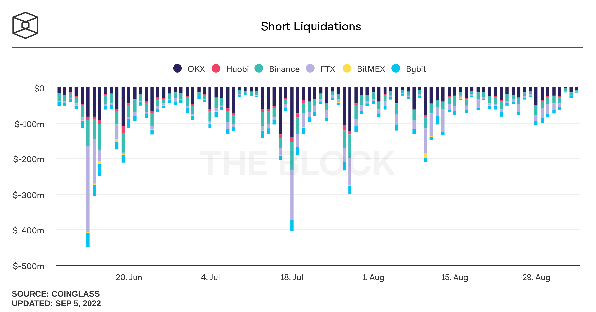
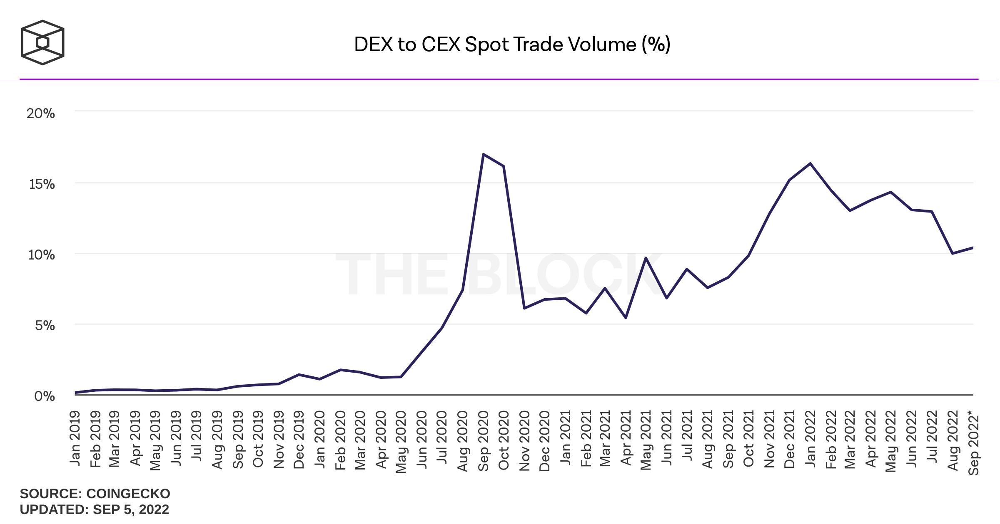
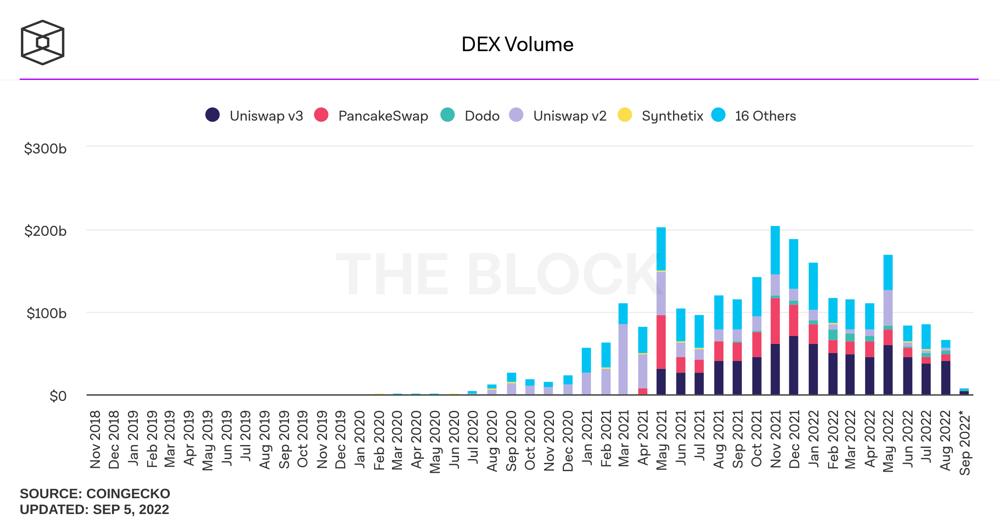
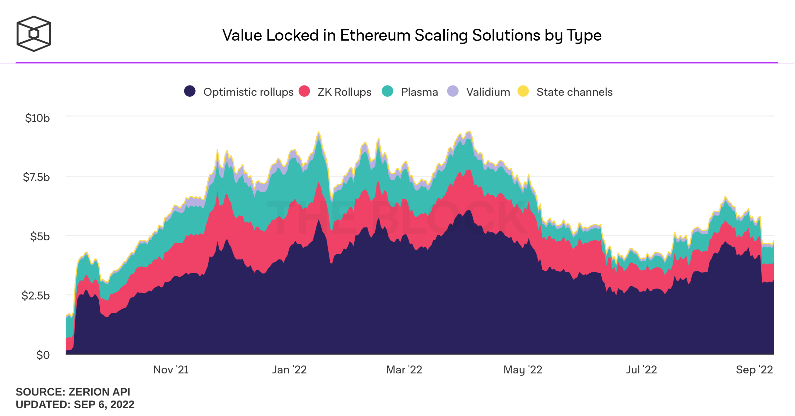

# 📊 Market Analysis


Updated: September 7, 2022

_All information in this section is sourced from publicly available data and represents a snapshot at the time of writing unless otherwise stated._&#x20;


This section aims to establish a general understanding of the current status quo in crypto markets and crypto trading as they are crucial factors for Yellow Network.&#x20;

Our market analysis will focus on three major topics:&#x20;

1. The Current State of Crypto Markets.
2. Trends and Expectations.
3. Problems and Roadblocks.

## Key Takeaways

* Blockchain has made its transition from a niche market to a multi-billion dollar industry.
* After a stellar 2021, the crypto industry is facing increased external and internal challenges.
* Solid regulatory frameworks will be critical to future mass adoption.
* Solving the blockchain trilemma remains the focal point of industry development.
* The industry is heading away from the "one-chain" approach, helped by Layer-2 and Layer-3 solutions.

## Current State of Crypto

### From a Stellar 2021

#### User Adoption

In our view, the year 2021 saw a pivotal change in the mainstream acceptance of crypto assets and blockchain technology, especially in the DeFi and NFT space.&#x20;

Web3 technology is particularly prone to the network effect, which suggests that platform value increases at a faster rate than the increase in new users. As a result, the valuations of many projects skyrocketed over the past two years.&#x20;

Major players such as Visa, Paypal, Walmart, Microsoft, and other players from various industries branched into the Web3 space, and El Salvador became the first country to make Bitcoin legal tender.&#x20;

Stablecoins have found broader institutional acceptance, crossing $5tn volume in 2021, a 370% year-on-year growth.&#x20;

Venture capital allocated to crypto projects surpassed $14bn spread over roughly 1,700 deals.&#x20;

#### The Gas Issue

The increase in crypto adoption has led to harsh spikes in transaction prices on certain blockchains, most notably ETH and BTC. This has started pushing many smaller players to the side. Gas prices significantly impact trading profitability, leading to failed trade executions and skewed pricing.&#x20;

<figure><figcaption>
Source: The Block, <a href="https://www.theblock.co/data/on-chain-metrics/comparison-bitcoin-ethereum/transaction-fees-daily">https://www.theblock.co/data/on-chain-metrics/comparison-bitcoin-ethereum/transaction-fees-daily</a>
</figcaption></figure>

#### Growth of Layer-1 and Layer-2 Platforms&#x20;

The emergence of DeFi drove large quantities of new users to L1 platforms. This caused congestion and gas fee spikes, especially on the ETH blockchain. This, in turn, gave rise to non-ETH solutions and other workarounds, most notably Layer-2 and Layer-3 projects.

Many of these solutions aim to provide additional scalability and eradicate some shortcomings of existing blockchain solutions.&#x20;

For example, the use of cross-chain bridging surged from $670M to $32B throughout 2021. However, this massive surge in volume increasingly attracts exploits and hacks, as shown in the graph below. &#x20;

<figure><figcaption>
Source: The Block, <a href="https://www.theblock.co/data/decentralized-finance/exploits/funds-stolen-by-defi-attackers">https://www.theblock.co/data/decentralized-finance/exploits/funds-stolen-by-defi-attackers</a>
</figcaption></figure>

### To a Crypto Winter in 2022

#### Falling Prices and Volumes

Following a strong year in 2021 for most crypto assets and the Web3 space in general, worsening global economic factors started spilling over into crypto markets. Most (crypto) assets have since seen a steep decline in exchange trading volumes, shrinking the total crypto market capitalization to about $1T, down from almost $3T at its peak in November 2021.

<figure><figcaption>
Source: The Block, <a href="https://www.theblock.co/data/crypto-markets/prices/crypto-total-marketcap">https://www.theblock.co/data/crypto-markets/prices/crypto-total-marketcap</a>
</figcaption></figure>

#### Failing Asset Managers and Protocols

Price declines in assets led to short liquidations and ultimately the collapse of several asset managers and entire blockchain protocols. 3 Arrow Capital (3AC) and Terra Protocol are the most prominent examples. Accelerating short liquidation leads to additional price pressure, ultimately causing and reinforcing a bear market.&#x20;

<figure><figcaption>
Source: The Block, <a href="https://www.theblock.co/data/crypto-markets/futures/short-liquidations">https://www.theblock.co/data/crypto-markets/futures/short-liquidations</a>
</figcaption></figure>

#### Impact on Exchanges 

Exchanges have seen a steep decline in activity and are confronted with [volumes down 50% from their highs in late 2021.](https://www.theblock.co/data/crypto-markets/spot/cryptocurrency-exchange-volume-monthly) Recent data suggests a bottoming out of falling exchange volumes. On the other hand, fiat-to-crypto exchange volumes continue to decline, resulting in reduced buying pressure and price support for most cryptocurrencies.&#x20;

While in the past two years decentralized exchanges (DEXs) have continuously gained market share over Centralized Exchanges this trend has started to reverse in the early months of 2022.

<figure><figcaption>
Source: The Block, <a href="https://www.theblock.co/data/decentralized-finance/dex-non-custodial/dex-to-cex-spot-trade-volume">https://www.theblock.co/data/decentralized-finance/dex-non-custodial/dex-to-cex-spot-trade-volume</a>
</figcaption></figure>

<figure><figcaption>
Source: The Block, <a href="https://www.theblock.co/data/decentralized-finance/dex-non-custodial/dex-volume-monthly">https://www.theblock.co/data/decentralized-finance/dex-non-custodial/dex-volume-monthly</a>
</figcaption></figure>

#### Scaling Solutions on the Rise 

Contrary to trading volumes and asset prices, value locked in scaling solutions has shown (some) resilience in 2022. State channel solutions still represent a relatively small market share when compared to Rollups, but have maintained an overall market share.&#x20;

<figure><figcaption>
Source: The Block, <a href="https://www.theblockcrypto.com/data/scaling-solutions/scaling-overview/value-locked-of-ethereum-scaling-solutions">https://www.theblockcrypto.com/data/scaling-solutions/scaling-overview/value-locked-of-ethereum-scaling-solutions</a>
</figcaption></figure>

#### Bitcoin Loses Market Share 

One of the most notable changes in the 2022 crypto landscape is Bitcoin losing overall market share to other coins, most notably Ethereum. While ETH has profited from increased interest ahead of the [Merge](https://ethereum.org/en/upgrades/merge/), i.e., the change from PoW to PoS, Bitcoin seems to have somewhat lost its place as the leading role in the recent cryptocurrency narrative.

The recent price declines have cast also doubt on Bitcoins' ability to act as an inflation hedge. At the same time the oldest, and still largest, cryptocurrency shows increased correlation with traditional asset benchmarks such as the S\&P500 and in particular the NASDAQ.&#x20;

#### The Rise of Regulations

Regulators and other governing bodies show increasing attention to both the Web3 space, and in particular to cryptocurrencies. While being a multi-trillion dollar industry, the Web3 landscape today remains fairly unregulated. Increasing reports of exploits, hacks, and project failures pose considerable risks to an ever-growing number of investors, stakeholders, and participants in the space.&#x20;

A lack of sufficient regulation makes it difficult to recover stolen funds. As a result, smaller players trying to enter the market suffer, due to low consumer confidence.\

## Trends and Expectations

#### New Policies and Regulations

A recent article by [The Block](https://www.theblock.co/post/167451/the-worlds-securities-law-watchdog-is-scrambling-to-create-common-standards-for-crypto) indicates that the world's securities watchdog is scrambling to create common standards for crypto in an attempt to bring more clarity to the legal aspect of the industry.&#x20;

The European Parliament is expected to follow up on its [attempt to regulate cryptocurrencies](https://www.europarl.europa.eu/news/en/headlines/economy/20220324STO26154/cryptocurrency-dangers-and-the-benefits-of-eu-legislation) across Europe.&#x20;

We expect most regulators to follow a path of gradual acceptance toward Web3 solutions in a shift from skepticism to pragmatism. In our eyes, this will benefit the industry at large and, after some initial adjustment, spark a new bull run in crypto markets.&#x20;

In their 2022 Outlook, [Sygnum](https://www.sygnum.com/digital-asset-outlook-report-download), a Swiss Digital Asset Bank, defines the following regulatory key areas:

* Clarification on the definition of Virtual Assets and Virtual Asset Service Providers.
* Clarity on issues around the use of Stablecoins.
* Guidance on risks and the tools available to countries to address the risks related to P2P transactions.
* Additional guidance on the Travel Rule, i.e., the transfer of identification for payments on the blockchain.
* Principles and guidelines on information sharing and cooperation amongst authorities competent to supervise Virtual Assets.&#x20;

#### Empowering Real-World use cases

The Web3 space will continue to mature and pivot towards more real-world applications. DeFi was the first field to reach critical mass in 2021 and we expect other sectors such as gaming and metaverse-related applications to gain momentum going forward.&#x20;

Existing and established use cases, like crypto trading, will continue to grow and so will enabling technologies, such as scalability and security solutions.&#x20;

[According to the UN](https://unctad.org/news/global-trade-hits-record-high-285-trillion-2021-likely-be-subdued-2022), global trade volumes in 2021 reached an estimated $28.5trn in goods and services. Given regulatory hurdles can be cleared, smart contracts are likely to see increased adoption in global trade, freeing up capital, reducing cost, and providing transparency and efficiency.&#x20;

#### Growth of Scalability Solutions to Continue

We expect the need and demand for scalability solutions to continue to grow exponentially over the coming years. Safety and security, rather than pure speed, will determine the success of these solutions.

According to a report by [Sygnum](https://www.sygnum.com/digital-asset-outlook-report-download), scalability solutions could help solve the dilemma of a single dominant blockchain. Receding Bitcoin dominance and the rise of Layer-2 solutions throughout 2021 and 2022 seem to confirm this thesis.&#x20;

## Roadblocks and Risks

Several roadblocks are likely to persist in the near future and will take time to overcome:

* Inconsistent regulatory approaches taken by different countries that enable regulatory arbitrage between jurisdictions.
* The dynamic pace of technological evolvement will continue to pose difficulties for regulators to adapt.
* The decentralized nature of blockchain makes it near impossible to regulate under existing law structures.
* As Web3 develops and finds more widespread adoption it will continue to show increased correlation with other, more traditional, markets and thus partially losing its diversification effect.
* An impending economic downturn caused by inflation and supply chain shortages could reduce venture capital flows and lead investors to reduce risk, thus leading to capital shortages and further price decline of digital assets.&#x20;

## Conclusion

After a strong performance in 2021, the crypto industry has now reached full public attention and is unlikely to disappear despite facing increasing challenges in 2022.&#x20;

We predict that some headwinds such as high inflation, supply chain shortages, and regulatory uncertainty, are temporary and likely to subdue over the next 12-24 months. &#x20;

Industry internal issues, such as the question of security and scalability, have been acknowledged and we see an increasing amount of solutions being developed to confront these issues.&#x20;

In our view, challenging market environments tend to have a cleansing effect in rapidly growing industries. Similar to the Dot-Com bubble in 2001, trying times reduce the number of bad actors and "hype" projects with no utility. Capital will flow towards ideas and companies that focus on advancing the technology and its use cases, ultimately improving the environment for all stakeholders.&#x20;

While there is a risk of consolidation and concentration by prominent players, the underlying decentralized nature of blockchain should, at least partially, prevent what happened to the internet over the past two decades, where a few large corporations control the market.&#x20;

Regulatory frameworks will have to be rewritten to accommodate the complex nature of decentralization in order to build trust and foster security. &#x20;

As a result, the collaboration between all stakeholders remains critical for widespread adoption.&#x20;
