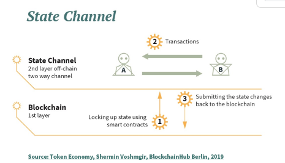

# Whitepaper

## Abstract

The cryptocurrency ecosystem has been plagued by a lack of scalability and interoperability primarily due to blockchains and exchanges that function in fragments of protocols. This has led to the isolation of liquidity and resources amongst different blockchain layers and exchanges. 

However, with the introduction of the Yellow Network, things are about to change. Yellow Network introduces a new generation of state-channel-based financial information exchange (FIX) communication systems between exchanges, brokers, and trading firms to enable truly decentralized trading and make Web3 a reality.

Yellow Network leverages Layer-3 protocol to create the first-ever decentralized broker clearing network that operates on state channel technology. With Yellow Network, two things are possible; users can kickstart their profitable exchange platform with liquidity supplied and shared by the network and are able to reduce trading fees by holding $YELLOW tokens drastically. It became necessary due to the fact that the current monolithic business structure of today’s crypto exchanges isn't scalable and does not interoperate with each other.

## Introduction

The usage, adoption, and application of cryptocurrencies and their prices have increased gradually over the past years, allowing the cryptocurrency asset class to [attract institutional investors](https://www.prnewswire.com/news-releases/crypto-adoption-on-way-to-mainstream-says-new-checkoutcom-report-301518399.html) and continue to gain popularity. As a result, the businesses In the sector have likewise seen a period of continuous growth. Particularly cryptocurrency exchanges have seen sustained growth in the past years. With the exponential growth of cryptocurrency assets, it's unsurprising that trading this asset class has become a public fascination.

For a variety of reasons, both retail and institutional investors are increasing their exposure to cryptocurrencies through many strategies such as ETFs and derivatives trading. Many of these investors were seeking a safe haven from inflationary fiat currency. They hedged assets that are uncorrelated with the price movements of typical financial products such as stocks or bonds. The [cryptocurrency market reached a record high of $3 trillion in November 2021](https://finance.yahoo.com/news/cryptocurrencies-hit-market-cap-3-063245377.html), when the world's two major cryptocurrencies, Bitcoin and Ethereum, rose to record highs and rallied more than 6% to reach $67,591.86 and 3.5% to reach $4,789.45, respectively.

Currently, the cryptocurrency market capitalization has been rallying at around $2Trillion, as can be seen from the graph above. One of the major drivers of this growth in the adoption and usage of cryptocurrency has been the cryptocurrency exchanges. Cryptocurrency exchanges are platforms that allow for the trading of cryptocurrencies for other asset classes, such as fiat and digital currencies. [Data from CoinMarketCap](https://coinmarketcap.com/rankings/exchanges/dex/) shows that there are 521 cryptocurrency exchanges as of May 2022, of which 306 are centralized exchanges (CEXs), and the remainder are decentralized exchanges (DEXs), derivatives, and loan markets.

One thing stands out among the growth of cryptocurrency exchanges and projects. Each of these platforms leverages a different blockchain protocol, performs different transactions and operations, and processes a unique volume of data. Likewise, it is becoming increasingly evident that their operations are siloed. Furthermore, the rapid growth of blockchain technology has resulted in the emergence of various chain configurations.

The siloed structure in the cryptocurrency industry has stalled scalability and is threatening the core fabric of the cryptocurrency ecosystem. This problem is exacerbated by the fact that there currently exist more than 18000 cryptocurrencies as of March 2022, with many of these cryptos using their proprietary blockchain protocols. One factor contributing to the complexity of cryptocurrency trading is the sheer number of blockchains and exchanges involved. For instance, if a user wishes to transfer 10ETH that exists on the Ethereum blockchain (ERC-20) to the Avalanche network, the user may be required to pass through many processes and steps to get AVAX tokens on the Avalanche network. This approach, particularly for inexperienced users, may involve considerable time spent looking for and evaluating decentralized finance (DeFi) tools and platforms to find the one that best fits a particular scenario. Experienced users will also need to factor in tracking wrapped token blockchain gas fees and navigating a lot of user interfaces. 

Additionally, both centralized and decentralized exchanges suffer from insufficient liquidity, which is spread across dozens of different marketplaces and exchanges that are compelled to compete. Each new blockchain project adds to this instability and greatly slows the crypto industry's growth and scaling. The exchange landscape faces massive challenges that have become difficult to overcome. The following are the prominent challenges faced by the crypto ecosystem today.

### Cross-Chain Transactions

Cross-chain interoperability is in demand and is a vital component of the success of several blockchain projects. Since the inception of open-source cryptocurrencies with Bitcoin in 2009, the number of blockchain networks with diverse designs and functionality has exploded. As the blockchain community has grown exponentially, financial information communication and data interchange across networks has become increasingly difficult.

#### What is a cross-chain?

A cross-chain is the capacity of two relatively independent blockchains to communicate with one another. Cross-chain implementation is primarily represented by asset swapping and asset transfer, both of which are critical components of the blockchain ecosystem. Cross-chain communication and transaction can be divided into _Isomorphic_ and _Heterogeneous_, depending on the underlying technology. 

For cross-chain transactions to occur, there are unique approaches to achieve interoperability across different chains:

* Atomic swaps 
* Federations 
* Stateless SPVs 
* Relay 

Despite the critical nature of blockchain interoperability, cross-chain systems still face several hurdles when it comes to transacting assets or data between chains. These difficulties include transaction rate bottlenecks and disparities in trust.

The Yellow Network builds on the development work of the current system by pooling liquidity from different chains using cutting-edge state channel technology to enable fast trading and reaching assets locked on isolated networks without directly bridging them. By leveraging state channel technology, users can be able to trade across many blockchain ecosystems, increasing liquidity, asset diversity, and trading volumes and growing the market for cryptocurrency. Cross-chain protocol leveraging state channels became necessary for the crypto market to fully use the power of interoperability and liquidity across different chains.

### State Channels

Scaling is perhaps the most significant roadblock to the widespread usage and adoption of blockchains and cryptocurrency today. While some programs are thriving today, the majority are still too slow and costly for average consumers.

[State channels](https://statechannels.org/) improve public blockchain throughput by reducing the computational load placed on nodes when processing and storing transactions. This makes it easy to run a node, which decentralizes the process of certifying the miners' work.

State channels, meanwhile, lower the costs associated with using the blockchain network. Rather than paying transaction fees, users only pay for gas when they open and close a channel. Additionally, state channels aid in the preservation of user privacy. Transactions within a channel are known only to the channel's members. This contrasts with transactions on the Ethereum blockchain, which record each transaction in a publicly auditable ledger. Finally, transactions within state channels achieve instantaneous completion. Users do not need to wait for each transaction to be confirmed on the blockchain, as each signed transaction complies with the network's regulations. This creates a more seamless user experience and more closely resembles how popular web applications operate now.

While most traders only use CEXs (Centralized Exchanges), the trading occurs in isolated silos, each CEX and DEX (Decentralized Exchange) has its own list of markets and unlike traditional finance those markets are not global.

Blockchain has brought decentralized computation, but it's far from being able scale to what traditional finance is today, due to the consensus algorithm which requires nodes to agree on the version of the state.

## Background

Crypto-currency trading is now a reality and is enjoying a fast rate of user adoption all over the world. Since Bitcoin many alternative projects were launched and users have now a large choice of different blockchains and many decentralized applications. New challenges appear to simplify the user journey in this wild wide web 3.0. Bridges are ones of several technologies brought to interconnect blockchains, it happened to suffer from a lack of decentralization, ERC20 native connection from one to another chain and a need of large liquidity for many tokens on every chain to satisfy the user demand.

### Related Work

#### Centralized Exchange

**Security concerns**

Centralized exchanges are fully in charge of the deposited users assets. It means users have to fully trust them to secure correctly platform wallets and process trades in fairly manner. Security has been taken seriously by big exchanges recently but it comes at a great cost, however we can still read news of exchanges being hacked and users funds being drained by attackers. Most of small exchange can't afford the cost of securing correctly users funds.

**Support of blockchains**

To keep a centralized exchange running, a lot of operations are needed. We just mentioned the security aspect which require a full-time focus by a dedicated team. The support of many blockchains is also very complicated and leads to high cost, each of them needs to be monitored specifically to make sure nodes and platform applications stay synchronized and process blocks in real time. The load of some chains sometime jumps quickly with the cost of transactions, this can lead to withdrawals not being proceed or very slowly, overall the gas price for withdrawals transactions and deposits processing might have to be adjusted frequently.

**Compliance**

For an exchange to comply with local regulations can be very complicated. Small exchanges will probably prefer to target a single market and comply with a single regulator. An other approach is to simply register the company in a country where they can operate without any regulation, this solution expose users to the goodwill of the platform operator, regulator rules being usually made to protect customers.

**Market making & Access to liquidity**

Running an exchange with many markets imposes to maintain orderbooks with tight spreads in order to provide the best offers possible to users. It also requires deep liquidity in the orderbook to avoid big price moves in case of sporadic big demand on a market.

Centralized exchanges usually delegate this duty to "market makers", this service can be very expensive and still the exchange might have to provide a big part of the liquidity to be injected in the orderbook.

### Uniswap S**hort History**

Uniswap is a decentralized exchange application, launched in 2018 \[@uniswap-history] it's the first DEX to gain a significant traction on Ethereum mainnet by August 2020. Since then many clones and other decentralized applications were launched on many blockchains and used by millions of users to swap tokens, lend/borrow crypto-currencies assets, bridge funds between blockchains and many more use cases.

Uniswap paved the way of DeFi (Decentralized Finance).

#### **Security, Auditability**

It brought many advantages compared to centralized exchanges. The exchange software is fully implemented in smart-contracts that are deployed on the blockchain, thus anyone can read how it works, many audits are performed by independents parties, many DeFi applications were left with breaches and funds were exploited, but over time the security of those applications tends to be proven.

#### **Automatic market making**

Anyone can provide liquidity to Uniswap markets (AKA pools), and receive a revenue share from fees collected during trading (AKA swaps). Moreover the price of assets is managed automatically, every trade impacts the price up or down depending if it's a ask or a bid, since the version one the protocol evolved to be more resilient in v2 and to use more effectively the liquidity in v3 \[@angeris2020improved].

Uniswap protocol provided an elegant solution to the problem of market making and access to liquidity.

#### **Performances**

The success of those applications lead to traffic jams in Ethereum network, cost of transactions have been growing to reach unsustainable levels. DEX and DeFi application are facing the limitation of blockchains throughput. Many projects claim to solve the problem of blockchains scalibity, some drastically improve the throughput of transaction like Polygon or Solana.

#### **Front running bots**

Transparency of blockchain transactions and the fact that Ethereum order transactions by gas price exposes users of DEXes to front-run bots \[@daian2019flash].

Such bots are monitoring the blockchain and the in-memory transactions pool containing (transactions not yet mined in a block) for incoming swap transactions. They check slippage tolerance allowed by the user, calculate the cost of front-running transactions, when profitable they execute a transaction just before the user by setting a higher gas price and finally a transaction just after the user to take the profit.

#### **Comply with local regulations**

Decentralized application are accessible by everyone on the planet the same way, without any difference between users. This feature allows anyone to access crypto-currencies wallets and use those solutions, this is a very powerful feature which gives access to people who can't open a bank account to crypto-currencies and decentralized finance.

Nevertheless each country has specific regulations in place applied to financial products, thus those fully open and restrictionless solutions are violating those rules.

#### Lightning Network \[@poon2016bitcoin]

Lightning network is a _layer 2_ solution for Bitcoin network. It was proposed as a solution to the scalability problem of Bitcoin network. It leverages state channel technology to be used as payments channels to perform any number of off-chain transactions. A payment channel is initiated by an on-chain funding transaction, then it's followed by any number of off-chain transactions, finally to commit balances a settlement transaction is performed on-chain; while lightning network introduce real-time fund transfer in blockchain, our protocol leverage the same technology for high frequency trading.

#### DyDx \[@juliano2017dydx]

DyDx is a trading platform of derivatives markets. It combines the speed of centralized orderbook and the transparency of decentralized applications. The result is a more secure and faster software architecture; The downside is that it's limited to Ethereum's users.

#### Qredo \[@mccuskerqredo]

Qredo focuses on securing digital assets using MPC \[REFERENCE NEEDED], eliminating the sensitive private key from the signature computation. It also allows settlements by updating an internal ledger entry without costly transaction on the blockchain \[TO BE CONFIRMED]. While Qredo brings state of the art security for digital assets it doesn't facilitate high frequency trading.

#### LayerZero

LayerZero provides an SDK which enable cross-chains transactions; but it requires to modify existing smart contracts and doesn't solve performance issues, it actually increase the numbers of transactions on already congested chains.

## Design

Mesh network

### Network participants

#### Retail brokers

A small exchange, located on a specific country or region, comply with local regulations. In our network we define brokers as non-custodial business.

#### Market makers

Market makers are providing liquidity to the network, they create and maintain open orders to allow users to access to the best offers possible. They are getting fees from trades.

#### Exchanges

Exchanges are big players of the network, they usually target a global audience and are regulated in many different countries. They can list exclusive tokens to the network and bring some market makers. They can also manage themselves the platform custody. In short those actors are managing all roles of network participants, they don't absolutely need to connect to others brokers, still it can only be better for their customers to bring more liquidity and offers on markets.

#### Custodians

Custodians are in charge of holding customers funds securely. Additionally they allow the broker to easily connect to multiple blockchains, depending on their current supported blockchains.

We plan to support following custodians as a start:

* Qredo
* Cobo
* Fireblocks
* Gnosis safe (decentralized)

### System components

#### Network nodes

Network nodes are operated by brokers, they have local markets and their own connections to blockchains and custodians; they interconnect with different brokers to bring liquidity to their markets.

#### Adjudicator

The adjudicator is a smart contract used by brokers to validate a settlement, it verifies that the last state transition is valid and signed by both brokers. Being a smart contract ensure brokers rules transparency and they won't change over time without both parties to agree to upgrade to a newer version of the protocol.

#### Custodian

Custodian are responsible of holding users' funds securely. It can be an external provider or a smart contract. Custodian are using a set or rules to release funds, each technology can provide different set of features to increase the security of the funds and make sure the user requesting a withdrawal is the real initiator of the request and make sure he didn't performed any kind of fraud.

### Protocol

Yellow network allows brokers to peer liquidity from one to another. A broker peering with another broker on a market will display orders from the other broker in his orderbook, this extends his offering and increase the overall liquidity available for his users. When a user takes an offer coming from another broker, brokers exchange liabilities using state channel protocol to ensure both agree on the accounting change. Later a settlement process can be initiated by any broker to lower their risk and move partial or all funds owed from one to another.

#### Collateral

Both exchanges have to lock a collateral in order to guaranty they are solvable for the other peer. Different currencies can be used as collateral, a mix of stable coins and major crypto-currencies tokens is probably a good choice for the platform in order to keep a relative stability of this collateral value while the market swings.

#### B2B (Broker to Broker) liquidity channel

Brokers are using a state channel protocol \[@perun2] to keep track of assets owned from one broker to another. This technology allows a secure track of funds without the need of on-chain transaction for every trade. It makes the trading process between two brokers very fast and secure.

To open a state-channel, brokers need to agree on an amount of YELLOW tokens to be used as collateral. Once they have an agreement on the amount and they both deposited the tokens, the state-channel is active and they can start trading.

**State definition:**

| Field               | Protobuf type   | Description                                                                                                                                    |
| ------------------- | --------------- | ---------------------------------------------------------------------------------------------------------------------------------------------- |
| chain\_id           | uint64          | Identifier of the blockchain on which the application is deployed                                                                              |
| participants        | repeated string | Brokers addresses                                                                                                                              |
| channel\_nonce      | uint64          | Unique identifier of the channel for all participants                                                                                          |
| app\_definition     | string          | Address of the smart contract of the adjudicator application                                                                                   |
| challenge\_duration | uint64          |                                                                                                                                                |
| app\_data           | bytes           | See bellow the definition of the  app\_data for Yellow Network liquidity channel                                                               |
| outcome             | bytes           |                                                                                                                                                |
| turn\_num           | uint64          | Turn number, this number is incrementing at every turn, it allows to easily identify the latest version of a state                             |
| is\_final           | bool            | Once true and signed by all participant the channel is closed and the final outcome can be applied on the blockchain safely by any participant |

#### Remote order matching

When a user order matches an order from a peer-broker, the platform will use the active state-channel with the peer to perform the trade and account the liabilities of one broker to another.

#### Settlement

Every once for a while brokers will perform a settlement process to finally transfer assets owns to each other. A settlement process can be triggered by any broker at any time. A broker can decide to settle if it needs some asset liquidity, to honor a withdrawal request for example. An other reason of triggering a settlement is the value of assets being hold from one to another getting unbalanced, if the difference of assets value between two brokers reach the value of the collateral it's getting urgent for one broker to trigger the settlement.

#### Multi-chain & Multi-custody support

The broker can connect to many custodians solutions, each custody solution have a different list of supported blockchains. The broker will benefit from supported blockchains of his custodies. Once connected to a custody, users will be able to deposit and withdraw funds from all supported blockchains.

#### Comparison

| Criteria         | Existing solutions                                                                  | Yellow Network                                                                                      |
| ---------------- | ----------------------------------------------------------------------------------- | --------------------------------------------------------------------------------------------------- |
| Speed            | 
CEX: 50-450 ms DEX: 30-120 sec
                                            | You have the lowest latency at any point on the globe: 10-50 ms                                     |
| Liquidity        | Fragmented and in competition for stacking                                          | Aggregated without locking requirements, you can mine trading fees without unstacking your Assets   |
| Cross-chain      | Using bridges, extremely high risk and slow                                         | Through layer-3 Virtualization, off-chain assets can remain in cold wallets but traded at low costs |
| Decentralization | 
CEX: Are centralized in a data center. DEX: Are located on a single chain
 | High, True Decentralization of business, data centers, and chains                                   |

Table: Benefits of solution

## Finance

### ECN

An electronic communication network (ECN) is a computerized system that automatically matches buy and sell orders for securities in the market. ECN trading is especially helpful when investors in different geographic areas wish to complete a secure transaction without the use of a third party.

**ECN facilitates access to brokers to global financial markets; Yellow network protocol forms a decentralized ECN for digital assets.**

### Clearing house

A clearing house is a financial institution formed to facilitate the exchange securities, commodities or derivatives transactions. The clearing house stands between two broker firms to reduce the risk of a member firm failing to honor its trade settlement obligations.

The clearinghouse enters the picture after a buyer and a seller execute a trade. Its role is to accomplish the steps that finalize, and therefore validate, the transaction. In acting as a middleman, the clearinghouse provides the security and efficiency that is integral to stability in a financial market.

**Facilitates cross brokerage transactions; Yellow network brings this functionality using state channel technology and settlement using a smart contract.**

### Cross-currency swap

A cross-currency swap's (XCS's) effective description is a derivative contract, agreed between two counterparts, which specifies the nature of an exchange of payments benchmarked against two interest rate indexes denominated in two different currencies. It also specifies an initial exchange of notional currency in each different currency and the terms of 1that repayment of notional currency over the life of the swap

|                | Number of tx | Value per tx                  | Frequency                 | Network |
| -------------- | ------------ | ----------------------------- | ------------------------- | ------- |
| **Trading**    | High         | Low \[$100 - $1,000]          | 500-1000 times per second | Layer 3 |
| **Clearing**   | Medium       | Medium \[$10,000 - $100,000]  | Daily                     | Layer 2 |
| **Settlement** | Low          | High \[$100,000 - $1,000,000] | Weekly                    | Layer 1 |

Table: Decoupling Trading, Clearing and settlement

## Conclusion

Yellow Network is an overlay mesh peer-to-peer (P2P) network that uses state channels to connect all blockchains, allowing it to reach any token locked in isolated networks without the need for cross-chain bridging.

The Yellow Network is matching throughput averages billions of messages per day, which is far quicker than any Layer-1 and Layer-2 solution currently available. Yellow Network is basically an automated smart clearing house, comparable to the manual clearinghouses used in conventional finance, that acts as a mediator between brokers. The Network provides users with a protocol that works worldwide, an all-in-one toolset, and a Web3 solution ready for the mature retail global finance market by offering real-time inter-broker exchange, near-instant off-chain transactions, and efficient on-chain transactions.

The Yellow network leverages state channel technology to revolutionize trading cryptocurrency through decentralized broker clearing networks. By decoupling trading and settlement, the Yellow Network protocol enables true decentralization of high-frequency trading and widens access to a great variety of assets, including digital and traditional assets.

## References

::: {#refs} :::
