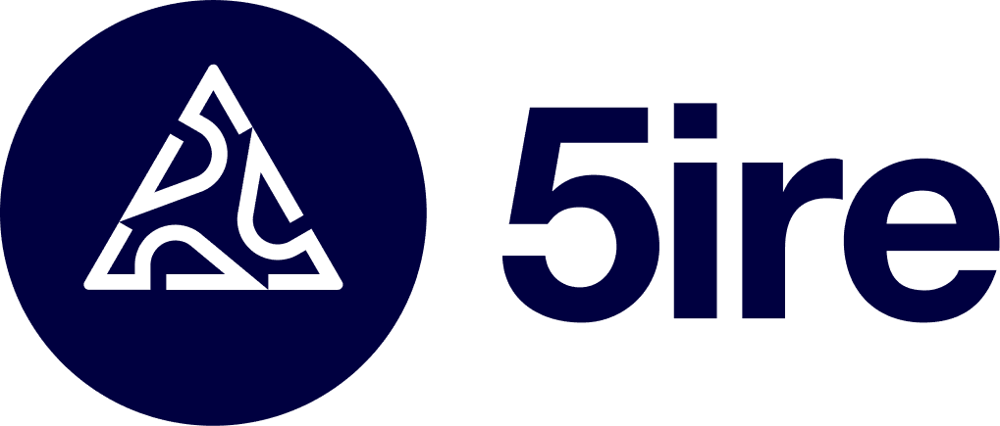
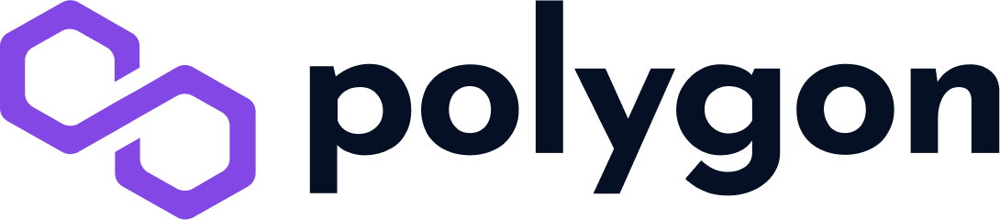
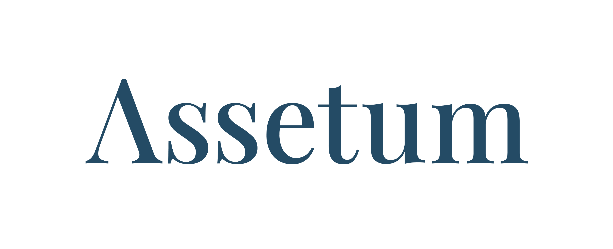
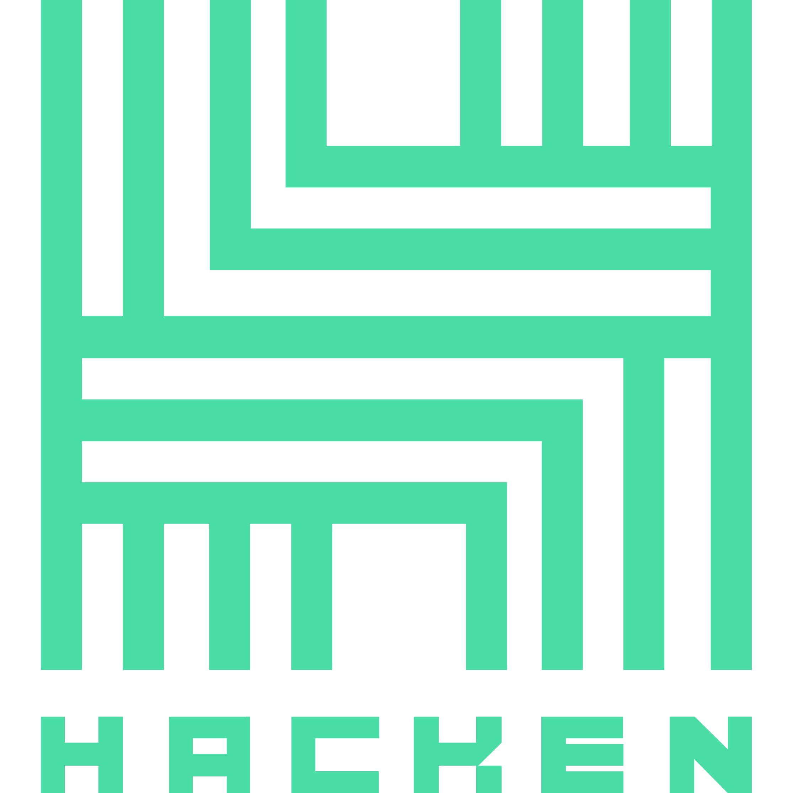

# 👥 Partners & Advisors


Yellow Network is a project in development. Not all solutions presented in the following (sub)sections are implemented at this stage. The current, and all subsequent sub-pages, are subject to change.&#x20;

For more information, visit the [Roadmap](../about/roadmap.md)


We are proud to have a strong and ever-expanding network of Advisors, Backers, and Partners from different fields and industries. These partnerships allow us to achieve far-reaching impact and scale.

If you are interested in partnering with Yellow Network, reach out to us via our [social media](broken-reference).&#x20;

## **Advisors**

Learn more about our trusted advisors who help to promote Yellow Network and provide us with decades of expertise:&#x20;

 **Chris Larsen -** [Co-founder and Chairman, Ripple](https://ripple.com/company/leadership/)

.png>) **Robert Drost** - [Head of R\&D, Consensys](https://www.linkedin.com/in/rjdrost/)

.png>) **Juan Otero** - [Founder & CEO, Travala.com](https://www.linkedin.com/in/joterovila/?originalSubdomain=au)

## Backers

Learn more about our cornerstone backers:

Founded in 2013, GSR is a crypto market maker with 300 employees across the globe. GSR specializes in providing liquidity, risk management strategies, and structured products to sophisticated global investors in the digital assets industry. A leadership team of veteran finance and technology executives from Goldman Sachs, Citadel, J.P. Morgan, and Two Sigma, among others, has created one of the world’s fastest and most robust digital asset trading systems.

GSR is deeply embedded in every major sector of the cryptocurrency ecosystem. GRS works with leading cryptocurrency projects, exchanges, funds, and miners as well as financial institutions taking their first steps into the world of digital assets.&#x20;

Founded in 2013, Gate.io has strived to provide its users with the best trading experience in the last 8 years. In terms of trading volume, Gate.io is one of the top 10 crypto exchanges in the world listing crypto assets that are great in quality and have a high rate of return.

LD Capital is a leading crypto fund in investment and trading in primary and secondary markets, whose sub-funds include Beco Fund, FoF, hedge fund, Meta Fund, etc. Since its establishment in 2016, LD Capital has successively invested in more than 300 enterprises. With a highly professional global team and unique industrial resource advantages, LD Capital has laid its emphasis on offering superb services after investments, aiming to support the project in enhancing its long-term value and ecological investment throughout the life cycle.

More on [https://medium.com/yellow-blog/ld-capital-establishes-strategic-partnership-with-web3-disruptor-yellow-c0ccd59b7ebf](https://medium.com/yellow-blog/ld-capital-establishes-strategic-partnership-with-web3-disruptor-yellow-c0ccd59b7ebf)

A Blockchain Advisory and Investment Firm, incubating and accelerating early-stage startups since 2019.

More on [https://medium.com/yellow-blog/moonrock-capital-enter-a-strategic-partnership-with-yellow-7574a3aa2fce](https://medium.com/yellow-blog/moonrock-capital-enter-a-strategic-partnership-with-yellow-7574a3aa2fce)

A fifth-generation blockchain that aims to bring a paradigm shift from a for-profit to a for-benefit economy.&#x20;

5ire intends to be the leading blockchain ecosystem to solve sustainability issues with its proprietary nPoS-based algorithm. 5ireChain’s network acts as a governance structure that democratically empowers and incentivizes DAOs and Working Groups that accelerate the implementation of the UN 2030 Agenda. 5ire technology stack offers protocol-level SDG oracles, cross-chain interoperability, Metaverses, WebAssembly and EVM smart contracts, Real-time economy data collection and telemetry with IoT, AR/VR, smart sensors, and incentivized AI SDG analysis.

More on [https://medium.com/yellow-blog/5ire-joins-yellow-to-facilitate-adoption-of-the-web3-broker-clearing-network-b8c3fbe3faa0](https://medium.com/yellow-blog/5ire-joins-yellow-to-facilitate-adoption-of-the-web3-broker-clearing-network-b8c3fbe3faa0)

Founded in 2018, MEXC Global is known as the exchange of high-performance and mega transaction matching technology. The team at MEXC Global is some of the first movers and pioneers of financial and blockchain technology. Currently, MEXC Global caters to 10 M+ users in more than 170 countries around the world and we have just started. This magnificent achievement is a significant milestone, and MEXC Global aims to become the go-to platform for new traders and experienced investors as they move forward in their financial journey.

MEXC has a presence over and across major continents and jurisdictions around the globe and is regulated, either directly or through affiliates, by some of the world's most renowned jurisdictions. MEXC Global also offers localized language support for investors from different countries, making it easier for them to trade. The exchange at MEXC Global is a high-performance trading engine that has been developed by experts from the banking industry and is capable of completing 1.4 million transactions per second, which results in groundbreaking efficiency and enhanced performance. User security is of top priority at MEXC Global because of which our servers are hosted independently across multiple countries ensuring optimal data integrity and security.

<mark style="color:yellow;">**+more than 25**</mark> other crypto companies and investment funds

## Tech Partners

Learn more about some of our key tech partners:

Qredo is rearchitecting digital asset ownership and blockchain connectivity. A radical new approach to bring liquidity and capital efficiency to the blockchain economy, Qredo has pioneered the first decentralized trustless multi-party computation (MPC) custodial network. This advancement enables Qredo to offer decentralized custody, native cross-chain swaps, and cross-platform liquidity access.

Qredo works at the cutting-edge of cybersecurity and blockchain. By utilizing the latest innovations in cryptography and distributed ledger technology, Qredo delivers a powerful global network for securing and trading digital assets.

[https://www.qredo.com/](https://www.qredo.com/)

Cobo is Asia-Pacific’s largest crypto custodian. Trusted by over 300 institutions and HNWIs to grow and protect their crypto assets, the company focuses on building scalable infrastructure and powering the Web 3.0 revolution around the world. Its proprietary DeFi asset management services crossed the 1.5B AuM mark and achieved a unique risk to reward profile that rivals top hedge funds - without over-exposure to headwinds. As a strong blockchain and DeFi infrastructure builder, Cobo provides Software-as-a-Service products WaaS (wallet), Daas (DeFi), MaaS (NFT Minting) and StaaS (Staking). Amongst other projects, Cobo’s incubator arm also enriches the DeFi ecosystem through its investments in early stage innovative and promising DeFi projects. Its respected security team also features regularly in crypto communities for its contribution towards protecting the crypto ecosystem and patching the vulnerabilities in protocols.

[https://www.cobo.com/](https://www.cobo.com/)

Polygon believes in Web3 for all. Polygon is a decentralized Ethereum scaling platform that enables developers to build scalable user-friendly dApps with low transaction fees without ever sacrificing on security.

[https://polygon.technology/](https://polygon.technology/)

ConsenSys is the leading Ethereum software company. We enable developers, enterprises, and people worldwide to build next-generation applications, launch modern financial infrastructure, and access the decentralized web. Our product suite, composed of [Infura](https://infura.io/), [Quorum](https://consensys.net/quorum), [Truffle](http://trufflesuite.com/), [Codefi](https://codefi.consensys.net/), [MetaMask](https://metamask.io/), and [Diligence](https://consensys.net/diligence), serves millions of users, supports billions of blockchain-based queries for our clients, and has handled billions of dollars in digital assets. Ethereum is the largest programmable blockchain in the world, leading in business adoption, developer community, and DeFi activity. On this trusted, open source foundation, we are building the digital economy of tomorrow.

[https://consensys.net/](https://consensys.net/)

ConsenSys Mesh (a.k.a. MESH) is an accelerator, incubator, investor and enabler of blockchain technology solutions. Founded in 2015 by Ethereum co-founder Joseph Lubin, MESH is a network of loosely coupled, tightly aligned teams, products and investments with a single mission to champion global adoption and awareness of groundbreaking technologies in Web3.&#x20;

[https://www.mesh.xyz/](https://www.mesh.xyz/)

Zokyo is run by the engineers that built, ran or secured some of the largest cryptocurrency companies to date.\
\
Our team consists of crypto industry pioneers, veteran ethical hackers that have earned bounties from several Fortune 200 companies including (Uber, Paypal, Facebook, LinkedIn, etc), designers, engineers, tokenomic experts, advanced crypto traders, and experienced investors.

Our founder, Hartej Sawhney, co-founded Hosho, ranked #1 Smart Contract Auditor in 2019 by Forbes.

As industry pioneers, our team has played a key role in elevating standards in the digital asset ecosystem and introducing products and services that have set the industry benchmark for security, transparency, and compliance. Zokyo's efforts have been recognized as paving the way for the ongoing institutionalization of the industry.

[https://www.zokyo.io/](https://www.zokyo.io/)

For institutions that need to store and move digital assets without the operational or security headache.

Fireblocks streamlines operations by bringing all your exchanges, OTCs, counterparties, hot wallets, and custodians into one platform. Wallets, deposit addresses, and API credentials are secured using patent-pending chip isolation technology and the newest breakthrough in cryptography (MPC). Institutions are using Fireblocks to move funds securely in seconds – instead of hours.

[https://www.fireblocks.com/](https://www.fireblocks.com/)

[https://www.assetum.io/](https://www.assetum.io/)

Web3 Cybersecurity Auditor

[https://hacken.io/](https://hacken.io/)

Web3 scalability solutions&#x20;

[https://magmo.com/](https://magmo.com/)

<mark style="color:yellow;">**+10**</mark> other industry leaders
